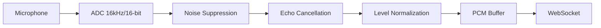

## Audio Requirements

<Card title="Required Format" icon="waveform">
  **Raw PCM, 16,000 Hz, 16-bit Signed Little-Endian, Mono**
</Card>

## Technical Specifications

| Parameter | Value | Description |
|-----------|-------|-------------|
| **Format** | PCM (Pulse Code Modulation) | Uncompressed linear audio |
| **Sample Rate** | 16,000 Hz | 16,000 samples per second |
| **Bit Depth** | 16-bit | Signed 16-bit integers |
| **Channels** | 1 (Mono) | Single audio channel |
| **Endianness** | Little-Endian | Least significant byte first |
| **Encoding** | Signed Integer | Two's complement representation |
| **Byte Order** | Low byte, High byte | For each 16-bit sample |

## Sample Format Details

### 16-bit Signed Integer Range

| Value | Hex | Binary | Description |
|-------|-----|--------|-------------|
| `32767` | `0x7FFF` | `0111111111111111` | Maximum positive |
| `1` | `0x0001` | `0000000000000001` | Smallest positive |
| `0` | `0x0000` | `0000000000000000` | Digital silence |
| `-1` | `0xFFFF` | `1111111111111111` | Smallest negative |
| `-32768` | `0x8000` | `1000000000000000` | Maximum negative |

### Little-Endian Byte Order

For a 16-bit sample value of `0x1234`:
- **Low byte (LSB)**: `0x34` (stored first)
- **High byte (MSB)**: `0x12` (stored second)

**Memory layout:**
```
Address: 0x00  0x01  0x02  0x03
Value:   0x34  0x12  0x78  0x56
Sample:  ←─0x1234──┘  ←─0x5678──┘
```

## Data Rate Calculations

### Bandwidth Requirements

```
Sample Rate: 16,000 Hz
Bit Depth: 16 bits = 2 bytes
Channels: 1 (Mono)

Bytes per second = 16,000 × 2 × 1 = 32,000 bytes/sec
Bits per second = 32,000 × 8 = 256,000 bps = 256 kbps
```

### Buffer Size Recommendations

| Duration | Samples | Bytes | Use Case |
|----------|---------|-------|----------|
| **10ms** | 160 | 320 | Minimal latency |
| **20ms** | 320 | 640 | **Recommended** |
| **50ms** | 800 | 1,600 | Standard buffer |
| **100ms** | 1,600 | 3,200 | Large buffer |

<Note>
**Recommended**: 20ms chunks (640 bytes) provide the best balance of latency and reliability.
</Note>

## Implementation Examples

<Tabs>
  <Tab title="Flutter/Dart Configuration">
    ```dart
    // Configure FlutterSound for recording
    await _recorder.startRecorder(
      codec: Codec.pcm16,           // 16-bit PCM
      sampleRate: 16000,            // 16kHz
      numChannels: 1,               // Mono
      bitRate: 256000,              // 256 kbps
    );

    // Configure FlutterSound for playback
    await _player.startPlayerFromStream(
      codec: Codec.pcm16,           // 16-bit PCM
      numChannels: 1,               // Mono
      sampleRate: 16000,            // 16kHz
    );
    ```

    **Audio Stream Processing:**
    ```dart
    _recorderSubscription = stream?.listen((Uint8List buffer) {
      // Verify buffer is correctly formatted
      assert(buffer.length % 2 == 0, 'Buffer must be even length');
      
      // Send to WebSocket
      _channel?.sink.add(buffer);
    });
    ```
  </Tab>

  <Tab title="JavaScript Web Audio API">
    ```javascript
    // AudioContext configuration
    const audioContext = new AudioContext({
      sampleRate: 16000
    });

    // MediaRecorder constraints
    const constraints = {
      audio: {
        sampleRate: 16000,
        channelCount: 1,
        echoCancellation: true,
        noiseSuppression: true,
        autoGainControl: false
      }
    };

    // Convert Float32Array to 16-bit PCM
    function float32ToPCM16(float32Array) {
      const pcm16 = new Int16Array(float32Array.length);
      for (let i = 0; i < float32Array.length; i++) {
        // Clamp to [-1, 1] range and convert to 16-bit
        const sample = Math.max(-1, Math.min(1, float32Array[i]));
        pcm16[i] = sample * 0x7FFF;
      }
      return new Uint8Array(pcm16.buffer);
    }
    ```
  </Tab>

  <Tab title="Python Audio Processing">
    ```python
    import numpy as np
    import struct

    # Audio parameters
    SAMPLE_RATE = 16000
    CHANNELS = 1
    SAMPLE_WIDTH = 2  # 16-bit = 2 bytes

    def float_to_pcm16(audio_data):
        """Convert float audio to 16-bit PCM"""
        # Clamp to [-1, 1] range
        audio_data = np.clip(audio_data, -1.0, 1.0)
        
        # Convert to 16-bit integers
        pcm_data = (audio_data * 32767).astype(np.int16)
        
        # Convert to little-endian bytes
        return pcm_data.tobytes()

    def pcm16_to_float(pcm_bytes):
        """Convert 16-bit PCM to float"""
        # Unpack little-endian 16-bit integers
        pcm_data = np.frombuffer(pcm_bytes, dtype=np.int16)
        
        # Convert to float [-1, 1] range
        return pcm_data.astype(np.float32) / 32767.0
    ```
  </Tab>
</Tabs>

## Audio Quality Guidelines

### Recording Best Practices

<CardGroup cols={2}>
  <Card title="Microphone Setup" icon="microphone">
    Use close-talking microphone 6-12 inches from speaker
  </Card>
  <Card title="Environment" icon="volume-x">
    Record in quiet environment with minimal background noise
  </Card>
  <Card title="Gain Control" icon="sliders">
    Avoid automatic gain control (AGC) for consistent levels
  </Card>
  <Card title="Sample Quality" icon="target">
    Maintain signal levels between -12dB to -6dB for optimal quality
  </Card>
</CardGroup>

### Audio Processing Chain



## Validation and Testing

### Format Validation

```javascript
function validateAudioFormat(audioBuffer) {
  // Check if buffer length is even (16-bit samples)
  if (audioBuffer.byteLength % 2 !== 0) {
    throw new Error('Invalid audio buffer: length must be even');
  }
  
  // Check for reasonable buffer size
  const minSize = 160; // 10ms at 16kHz
  const maxSize = 8000; // ~250ms at 16kHz
  
  if (audioBuffer.byteLength < minSize) {
    throw new Error('Audio buffer too small');
  }
  
  if (audioBuffer.byteLength > maxSize) {
    throw new Error('Audio buffer too large');
  }
  
  return true;
}
```

### Audio Level Monitoring

```dart
class AudioLevelMonitor {
  static double calculateRMS(Uint8List pcmData) {
    double sum = 0.0;
    final samples = pcmData.length ~/ 2;
    
    for (int i = 0; i < pcmData.length; i += 2) {
      // Convert little-endian bytes to 16-bit signed int
      final sample = (pcmData[i + 1] << 8) | pcmData[i];
      final signedSample = sample > 32767 ? sample - 65536 : sample;
      sum += signedSample * signedSample;
    }
    
    return sqrt(sum / samples);
  }
  
  static double rmsToDecibels(double rms) {
    return 20 * log(rms / 32767) / ln10;
  }
}
```

## Common Issues and Solutions

<Accordion title="Audio Distortion">
  **Symptoms:**
  - Crackling or popping sounds
  - Metallic audio quality
  - Clipped audio

  **Causes:**
  - Incorrect sample rate conversion
  - Audio clipping (levels too high)
  - Wrong endianness
  - Incorrect bit depth

  **Solutions:**
  ```dart
  // Ensure proper audio configuration
  await recorder.startRecorder(
    codec: Codec.pcm16,        // Correct: 16-bit PCM
    sampleRate: 16000,         // Correct: 16kHz
    numChannels: 1,            // Correct: Mono
  );
  ```
</Accordion>

<Accordion title="No Audio / Silence">
  **Symptoms:**
  - No sound transmitted or received
  - Zero bytes in audio buffers
  - WebSocket receives empty data

  **Debug Steps:**
  ```dart
  // Check audio permissions
  final status = await Permission.microphone.status;
  print('Microphone permission: $status');

  // Monitor audio data
  stream?.listen((buffer) {
    print('Audio buffer size: ${buffer?.length} bytes');
    if (buffer?.isNotEmpty == true) {
      final level = AudioLevelMonitor.calculateRMS(buffer!);
      print('Audio level: ${AudioLevelMonitor.rmsToDecibels(level)} dB');
    }
  });
  ```
</Accordion>

<Accordion title="Format Mismatch Errors">
  **Server Error:**
  ```json
  {
    "type": "error",
    "error": {
      "code": "INVALID_AUDIO_FORMAT",
      "message": "Audio must be 16-bit PCM at 16kHz mono"
    }
  }
  ```

  **Checklist:**
  - ✅ Sample rate is exactly 16,000 Hz
  - ✅ Bit depth is 16-bit (not 8-bit or 24-bit)
  - ✅ Channel count is 1 (mono)
  - ✅ Endianness is little-endian
  - ✅ Format is raw PCM (not compressed)
</Accordion>

## Testing Audio Format

### Test Audio Generation

```python
import numpy as np
import wave

def generate_test_tone(frequency=440, duration=1.0):
    """Generate a test tone in correct format"""
    sample_rate = 16000
    samples = int(sample_rate * duration)
    
    # Generate sine wave
    t = np.linspace(0, duration, samples, False)
    audio = np.sin(2 * np.pi * frequency * t)
    
    # Convert to 16-bit PCM
    audio_16bit = (audio * 32767).astype(np.int16)
    
    return audio_16bit.tobytes()

# Test with 440Hz tone for 1 second
test_audio = generate_test_tone()
print(f"Generated {len(test_audio)} bytes of test audio")
```

### Format Verification

```javascript
function verifyAudioFormat(audioBuffer) {
  const view = new DataView(audioBuffer);
  const samples = audioBuffer.byteLength / 2;
  
  console.log(`Audio buffer: ${audioBuffer.byteLength} bytes`);
  console.log(`Sample count: ${samples}`);
  console.log(`Duration: ${samples / 16000} seconds`);
  
  // Check first few samples
  for (let i = 0; i < Math.min(10, samples); i++) {
    const sample = view.getInt16(i * 2, true); // true = little-endian
    console.log(`Sample ${i}: ${sample}`);
  }
}
```