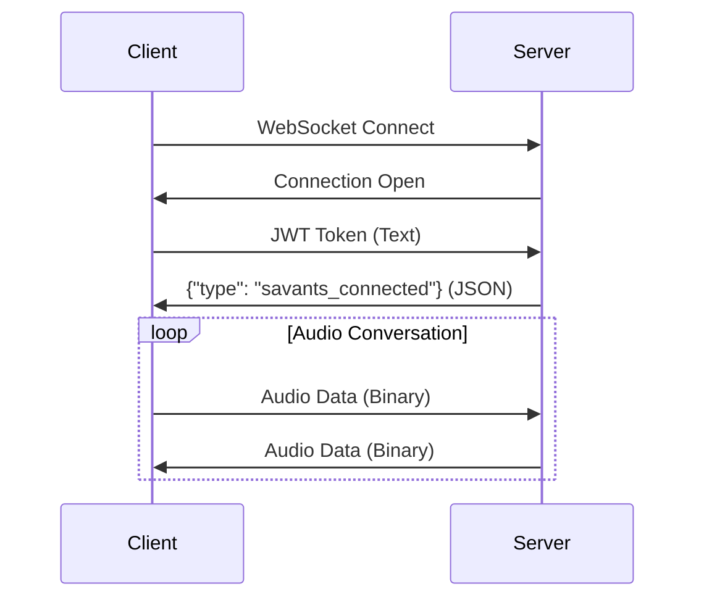
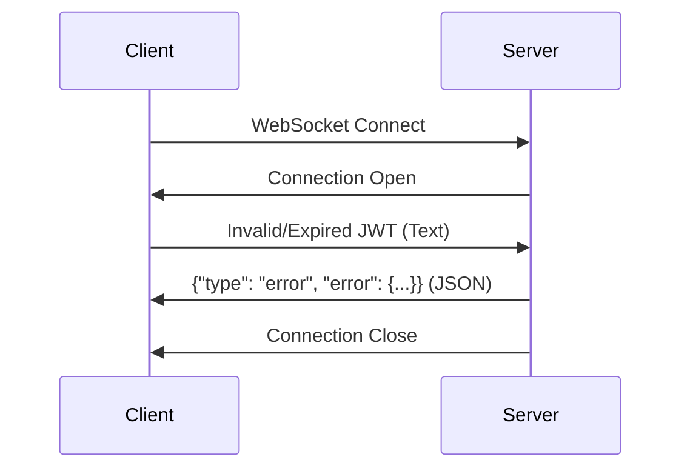

## Message Overview

The WebSocket API uses two types of messages:

<CardGroup cols={2}>
  <Card title="Text Messages" icon="message">
    JSON-formatted control messages for authentication and status
  </Card>
  <Card title="Binary Messages" icon="waveform">
    Raw audio data in PCM format for real-time streaming
  </Card>
</CardGroup>

## Message Direction

### Client → Server

<Tabs>
  <Tab title="Authentication Token">
    **Message Type:** Text (String)  
    **Purpose:** Authenticate WebSocket connection  
    **Timing:** First message after connection establishment

    **Format:**
    ```
    eyJhbGciOiJIUzI1NiIsInR5cCI6IkpXVCJ9.eyJzdWIiOiJkZXZpY2VfNDU2Nzg5MGFiY2RlZjEyMyIsImV4cCI6MTYzOTk4NzY1NCwiaWF0IjoxNjM5OTg3NTk0fQ.signature
    ```

    **Validation:**
    - Must be a valid JWT token
    - Token must not be expired
    - Token must contain valid device ID
    - Must be sent within 30 seconds of connection

    **Example:**
    ```javascript
    websocket.send(jwtToken); // Raw JWT string
    ```
  </Tab>

  <Tab title="Audio Data">
    **Message Type:** Binary (ArrayBuffer/Uint8List)  
    **Purpose:** Stream microphone audio to server  
    **Timing:** Continuous during active conversation

    **Format:** Raw PCM audio data
    - **No headers or metadata**
    - **Direct audio samples**
    - **Fixed format requirements**

    **Size Recommendations:**
    - **Chunk Size:** 320-1600 bytes (20-100ms of audio)
    - **Frequency:** 20-50ms intervals
    - **Max Size:** 8KB per message

    **Example:**
    ```javascript
    // 20ms of 16kHz mono 16-bit audio = 640 bytes
    const audioChunk = new Uint8Array(640);
    websocket.send(audioChunk.buffer);
    ```
  </Tab>
</Tabs>

### Server → Client

<Tabs>
  <Tab title="Connection Confirmation">
    **Message Type:** JSON Text  
    **Purpose:** Confirm successful authentication and connection

    **Schema:**
    ```json
    {
      "type": "savants_connected",
      "message": "string",
      "timestamp": "ISO8601 string",
      "sessionId": "string (optional)"
    }
    ```

    **Example:**
    ```json
    {
      "type": "savants_connected",
      "message": "Voice API connection established successfully",
      "timestamp": "2024-01-15T10:30:00.123Z",
      "sessionId": "sess_abc123def456"
    }
    ```

    **Client Action:** Begin audio streaming
  </Tab>

  <Tab title="Error Messages">
    **Message Type:** JSON Text  
    **Purpose:** Communicate errors and failures

    **Schema:**
    ```json
    {
      "type": "error",
      "error": {
        "code": "string",
        "message": "string",
        "details": "object (optional)",
        "timestamp": "ISO8601 string"
      }
    }
    ```

    **Error Codes:**
    | Code | Description | Action |
    |------|-------------|---------|
    | `TOKEN_EXPIRED` | JWT token has expired | Request new token |
    | `TOKEN_INVALID` | JWT format invalid | Check token format |
    | `AUTHENTICATION_FAILED` | Token validation failed | Verify credentials |
    | `INVALID_AUDIO_FORMAT` | Audio format incorrect | Check audio settings |
    | `CONNECTION_TIMEOUT` | Connection timed out | Retry connection |
    | `SERVER_ERROR` | Internal server error | Retry with backoff |

    **Examples:**
    ```json
    {
      "type": "error",
      "error": {
        "code": "TOKEN_EXPIRED",
        "message": "JWT token expired at 2024-01-15T10:29:00Z",
        "details": {
          "expiredAt": "2024-01-15T10:29:00Z",
          "currentTime": "2024-01-15T10:30:15Z"
        },
        "timestamp": "2024-01-15T10:30:15.456Z"
      }
    }
    ```

    ```json
    {
      "type": "error",
      "error": {
        "code": "INVALID_AUDIO_FORMAT",
        "message": "Audio must be 16-bit PCM at 16kHz mono",
        "details": {
          "expectedFormat": "PCM 16-bit 16kHz mono",
          "detectedFormat": "PCM 8-bit 8kHz stereo"
        },
        "timestamp": "2024-01-15T10:30:20.789Z"
      }
    }
    ```
  </Tab>

  <Tab title="Status Messages (Optional)">
    **Message Type:** JSON Text  
    **Purpose:** Provide status updates and information

    **Schema:**
    ```json
    {
      "type": "status",
      "status": "string",
      "message": "string (optional)",
      "timestamp": "ISO8601 string"
    }
    ```

    **Status Types:**
    - `ai_speaking` - AI is generating speech
    - `ai_listening` - AI is processing input
    - `connection_quality` - Network quality update

    **Example:**
    ```json
    {
      "type": "status", 
      "status": "ai_speaking",
      "message": "AI response generation started",
      "timestamp": "2024-01-15T10:30:25.123Z"
    }
    ```
  </Tab>

  <Tab title="Audio Data">
    **Message Type:** Binary (ArrayBuffer)  
    **Purpose:** Stream AI-generated speech to client  
    **Timing:** Continuous during AI responses

    **Format:** Raw PCM audio data
    - **Same format as client audio**
    - **No headers or metadata**
    - **Direct audio samples**

    **Characteristics:**
    - **Chunk Size:** Variable (typically 640-3200 bytes)
    - **Latency:** Real-time (minimal buffering)
    - **Quality:** Same as input audio specification

    **Handling:**
    ```javascript
    websocket.onmessage = (event) => {
      if (event.data instanceof ArrayBuffer) {
        // This is audio data from AI
        playAudioChunk(new Uint8Array(event.data));
      }
    };
    ```
  </Tab>
</Tabs>

## Message Validation

### Text Message Validation

<Accordion title="JSON Schema Validation">
  All text messages must be valid JSON. Invalid JSON will result in immediate connection termination.

  **Valid JSON:**
  ```json
  {"type": "vapi_connected", "message": "Connected"}
  ```

  **Invalid JSON:**
  ```json
  {type: "error", message: "Missing quotes"} // ❌ Invalid
  ```
</Accordion>

<Accordion title="Required Fields">
  All JSON messages must include:
  - `type` field (string)
  - Additional fields based on message type

  **Missing type field:**
  ```json
  {"message": "Connected"} // ❌ Missing 'type'
  ```
</Accordion>

### Binary Message Validation

<Accordion title="Audio Format Validation">
  Binary messages are validated for:
  - **Size**: Must be divisible by 2 (16-bit samples)
  - **Range**: Sample values within 16-bit signed range (-32768 to 32767)
  - **Frequency**: Should maintain ~16kHz equivalent timing

  **Invalid sizes:**
  - 641 bytes (not divisible by 2) ❌
  - 0 bytes (empty audio) ❌
  - >8KB (too large) ❌
</Accordion>

## Message Flow Examples

### Successful Connection



### Error Scenario



## Implementation Helpers

<Tabs>
  <Tab title="JavaScript">
    ```javascript
    class MessageHandler {
      static isTextMessage(data) {
        return typeof data === 'string';
      }
      
      static isBinaryMessage(data) {
        return data instanceof ArrayBuffer;
      }
      
      static parseTextMessage(data) {
        try {
          return JSON.parse(data);
        } catch (e) {
          throw new Error('Invalid JSON message');
        }
      }
      
      static validateMessage(message) {
        if (!message.type) {
          throw new Error('Message missing type field');
        }
        return true;
      }
    }
    ```
  </Tab>

  <Tab title="Flutter/Dart">
    ```dart
    class MessageHandler {
      static bool isTextMessage(dynamic data) {
        return data is String;
      }
      
      static bool isBinaryMessage(dynamic data) {
        return data is List<int>;
      }
      
      static Map<String, dynamic> parseTextMessage(String data) {
        try {
          return jsonDecode(data);
        } catch (e) {
          throw FormatException('Invalid JSON message');
        }
      }
      
      static void validateMessage(Map<String, dynamic> message) {
        if (!message.containsKey('type')) {
          throw ArgumentError('Message missing type field');
        }
      }
    }
    ```
  </Tab>
</Tabs>

## Debugging Messages

### Enable Message Logging

```javascript
websocket.onmessage = (event) => {
  if (typeof event.data === 'string') {
    console.log('Text message:', event.data);
  } else {
    console.log('Binary message size:', event.data.byteLength);
  }
};
```

### Common Issues

<Warning>
**Mixed Message Types**: Don't send audio data as text or text as binary - this will cause protocol errors.
</Warning>

<CardGroup cols={2}>
  <Card title="Invalid JSON" icon="exclamation-triangle">
    Always validate JSON before sending text messages
  </Card>
  <Card title="Audio Format" icon="microphone">
    Ensure audio data matches exact PCM specification
  </Card>
  <Card title="Message Order" icon="list-ordered">
    Send JWT token first, then wait for confirmation
  </Card>
  <Card title="Connection State" icon="wifi">
    Check WebSocket state before sending messages
  </Card>
</CardGroup>