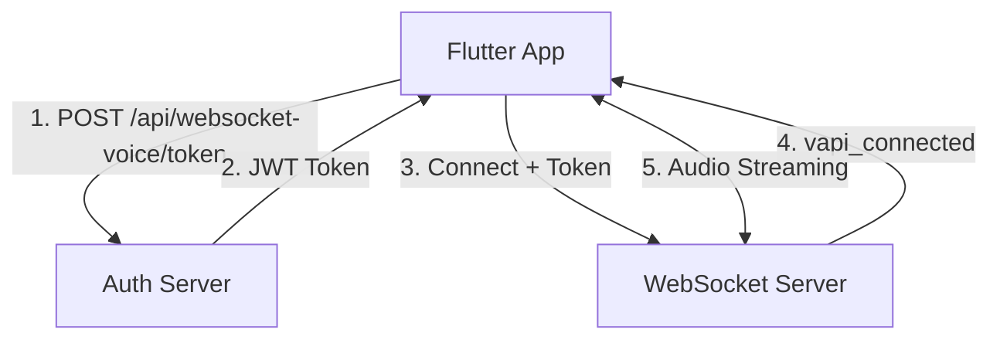

## Introduction

The Savants Voice API enables real-time, bidirectional voice conversations between your application and AI. The API uses a hybrid approach combining HTTP for authentication and WebSockets for real-time audio streaming.

```markdown
## Architecture



## Base Configuration

| Environment | Base URL |
|-------------|----------|
| **Production** | `https://your-production-server.com` |
| **WebSocket** | `wss://your-production-server.com/voice-stream` |

## API Endpoints

### Authentication
- **POST** `/api/websocket-voice/token` - Request JWT for WebSocket connection

### WebSocket
- **WSS** `/voice-stream` - Real-time audio streaming endpoint

## Authentication Flow

<Steps>
  <Step title="Request Token">
    POST to `/api/websocket-voice/token` with API key and device ID
  </Step>
  <Step title="Receive JWT">
    Server returns short-lived (1 minute) JWT token
  </Step>
  <Step title="WebSocket Auth">
    Send JWT as first message after WebSocket connection
  </Step>
  <Step title="Begin Streaming">
    Start bidirectional audio streaming
  </Step>
</Steps>

## Data Flow

### Client → Server
1. **Authentication Token** (String): JWT for connection authorization
2. **Audio Data** (Binary): PCM audio from microphone

### Server → Client  
1. **Connection Messages** (JSON): Status and error messages
2. **Audio Data** (Binary): PCM audio from AI

## Audio Specifications

| Property | Value |
|----------|-------|
| **Format** | Raw PCM |
| **Sample Rate** | 16,000 Hz |
| **Bit Depth** | 16-bit |
| **Channels** | 1 (Mono) |
| **Endianness** | Little-Endian |
| **Encoding** | Signed Integer |

## Rate Limits

| Resource | Limit |
|----------|-------|
| **Token Requests** | 60/minute per device |
| **Concurrent Connections** | 10 per device |
| **Audio Streaming** | No specific limit (bandwidth dependent) |

## Error Handling

All errors follow a consistent format:

```json
{
  "error": {
    "code": "ERROR_CODE",
    "message": "Human-readable description"
  }
}
```

## SDK Support

| Language | Status | Package |
|----------|--------|---------|
| **Flutter/Dart** | ✅ Official | Native implementation |
| **JavaScript** | 🚧 Planned | Coming soon |
| **Python** | 🚧 Planned | Coming soon |

## Security

- **Transport Security**: All connections use TLS/SSL encryption
- **Authentication**: JWT-based token authentication
- **Token Expiry**: 1-minute token lifespan prevents replay attacks
- **No Data Storage**: Audio streams are not stored server-side

## Versioning

Current API version: **v1**

The API uses URL-based versioning:
```
https://your-server.com/api/v1/websocket-voice/token
```

## Support

- **Technical Documentation**: This reference guide
- **Integration Support**: [support@thesavants.ai](mailto:support@thesavants.ai)
- **Response Time**: 24-48 hours for technical inquiries