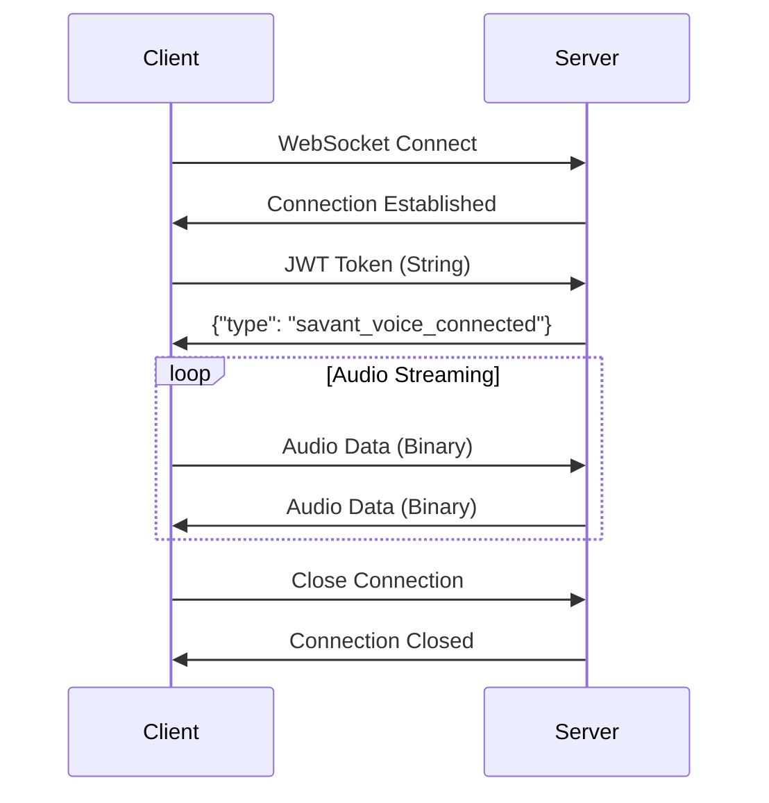

## Endpoint

<Card title="WebSocket Connection" icon="plug">
  **URL:** `wss://api.thesavants.ai/voice-stream`
</Card>

## Connection Lifecycle



## Authentication Handshake

<Steps>
  <Step title="Establish Connection">
    Open WebSocket connection to the endpoint
  </Step>
  <Step title="Send Token">
    Immediately send JWT token as first message (String)
  </Step>
  <Step title="Await Confirmation">
    Wait for `savant_voice_connected` message from server
  </Step>
  <Step title="Begin Streaming">
    Start sending audio data as binary messages
  </Step>
</Steps>

## Connection States

| State | Description | Actions |
|-------|-------------|---------|
| `CONNECTING` | WebSocket handshake in progress | Wait for connection |
| `AUTHENTICATING` | JWT token sent, awaiting confirmation | Monitor for `savant_voice_connected` |
| `CONNECTED` | Ready for audio streaming | Send/receive audio data |
| `ERROR` | Connection failed or error occurred | Handle error, retry if appropriate |
| `CLOSED` | Connection terminated | Clean up resources |

## Message Protocol

### Client → Server Messages

<Tabs>
  <Tab title="Authentication Token">
    **Type:** String  
    **Timing:** First message after connection  
    **Format:** Raw JWT token

    ```javascript
    websocket.send("eyJhbGciOiJIUzI1NiIsInR5cCI6IkpXVCJ9...");
    ```
  </Tab>

  <Tab title="Audio Data">
    **Type:** Binary (ArrayBuffer/Uint8Array)  
    **Format:** Raw PCM audio  
    **Timing:** Continuous during conversation

    ```javascript
    // Send PCM audio data
    websocket.send(audioBuffer); // Uint8Array containing PCM data
    ```

    **Audio Requirements:**
    - Format: Raw PCM
    - Sample Rate: 16,000 Hz
    - Bit Depth: 16-bit signed
    - Channels: 1 (Mono)
    - Endianness: Little-endian
  </Tab>
</Tabs>

### Server → Client Messages

<Tabs>
  <Tab title="Connection Confirmed">
    **Type:** JSON String  
    **Timing:** After successful authentication

    ```json
    {
      "type": "vapi_connected",
      "message": "Voice API connection established",
      "timestamp": "2024-01-15T10:30:00.000Z"
    }
    ```
  </Tab>

  <Tab title="Error Messages">
    **Type:** JSON String  
    **Timing:** When errors occur

    ```json
    {
      "type": "error",
      "error": {
        "code": "TOKEN_EXPIRED",
        "message": "JWT token has expired",
        "timestamp": "2024-01-15T10:30:00.000Z"
      }
    }
    ```

    **Common Error Codes:**
    - `TOKEN_EXPIRED` - JWT token has expired
    - `TOKEN_INVALID` - JWT token is malformed
    - `AUTHENTICATION_FAILED` - Token validation failed
    - `INVALID_AUDIO_FORMAT` - Audio data format incorrect
    - `CONNECTION_TIMEOUT` - Connection timed out
  </Tab>

  <Tab title="Audio Data">
    **Type:** Binary (ArrayBuffer)  
    **Format:** Raw PCM audio from AI  
    **Timing:** Continuous during conversation

    **Audio Format:**
    - Format: Raw PCM
    - Sample Rate: 16,000 Hz  
    - Bit Depth: 16-bit signed
    - Channels: 1 (Mono)
    - Endianness: Little-endian
  </Tab>
</Tabs>

## Connection Parameters

### URL Parameters
The WebSocket endpoint does not accept URL parameters.

### Headers
Standard WebSocket headers are used:

```http
GET /voice-stream HTTP/1.1
Host: your-server.com
Upgrade: websocket
Connection: Upgrade
Sec-WebSocket-Key: x3JJHMbDL1EzLkh9GBhXDw==
Sec-WebSocket-Version: 13
```

### Subprotocols
No custom subprotocols are required.

## Error Handling

### Connection Errors

<Accordion title="Connection Failed">
  **HTTP Status Codes:**
  - `400 Bad Request` - Invalid WebSocket request
  - `401 Unauthorized` - Authentication required (shouldn't happen at connection)
  - `403 Forbidden` - Access denied
  - `404 Not Found` - Invalid endpoint
  - `500 Internal Server Error` - Server error
  - `503 Service Unavailable` - Server overloaded

  **Client Actions:**
  - Verify endpoint URL
  - Check network connectivity
  - Implement exponential backoff for retries
</Accordion>

<Accordion title="Authentication Errors">
  **After Connection Established:**
  ```json
  {
    "type": "error",
    "error": {
      "code": "TOKEN_INVALID",
      "message": "Invalid JWT token format"
    }
  }
  ```

  **Client Actions:**
  - Request new JWT token
  - Verify token format
  - Check token expiration
</Accordion>

<Accordion title="Audio Format Errors">
  ```json
  {
    "type": "error", 
    "error": {
      "code": "INVALID_AUDIO_FORMAT",
      "message": "Audio must be 16-bit PCM at 16kHz mono"
    }
  }
  ```

  **Client Actions:**
  - Verify audio configuration
  - Check sample rate (16kHz)
  - Ensure mono channel
  - Confirm 16-bit PCM format
</Accordion>

## Implementation Examples

<Tabs>
  <Tab title="JavaScript">
    ```javascript
    class VoiceWebSocket {
      constructor(token) {
        this.token = token;
        this.ws = null;
      }

      connect() {
        return new Promise((resolve, reject) => {
          this.ws = new WebSocket('wss://your-server.com/voice-stream');
          
          this.ws.onopen = () => {
            // Send authentication token immediately
            this.ws.send(this.token);
          };
          
          this.ws.onmessage = (event) => {
            if (typeof event.data === 'string') {
              const message = JSON.parse(event.data);
              if (message.type === 'savant_voice_connected') {
                resolve();
              } else if (message.type === 'error') {
                reject(new Error(message.error.message));
              }
            } else {
              // Handle incoming audio data
              this.handleAudioData(event.data);
            }
          };
          
          this.ws.onerror = (error) => reject(error);
          this.ws.onclose = () => this.handleDisconnection();
        });
      }

      sendAudio(audioData) {
        if (this.ws.readyState === WebSocket.OPEN) {
          this.ws.send(audioData);
        }
      }

      close() {
        if (this.ws) {
          this.ws.close();
        }
      }
    }
    ```
  </Tab>

  <Tab title="Flutter/Dart">
    ```dart
    class VoiceWebSocket {
      WebSocketChannel? _channel;
      StreamSubscription? _subscription;

      Future<void> connect(String token) async {
        _channel = WebSocketChannel.connect(
          Uri.parse('wss://your-server.com/voice-stream')
        );

        _subscription = _channel!.stream.listen(
          (message) => _handleMessage(message),
          onError: (error) => _handleError(error),
          onDone: () => _handleDisconnection(),
        );

        // Send authentication token
        _channel!.sink.add(token);
      }

      void _handleMessage(dynamic message) {
        if (message is String) {
          final data = jsonDecode(message);
          if (data['type'] == 'savant_voice_connected') {
            _onConnected();
          } else if (data['type'] == 'error') {
            _onError(data['error']);
          }
        } else if (message is List<int>) {
          _handleAudioData(Uint8List.fromList(message));
        }
      }

      void sendAudio(Uint8List audioData) {
        _channel?.sink.add(audioData);
      }

      void close() {
        _subscription?.cancel();
        _channel?.sink.close();
      }
    }
    ```
  </Tab>
</Tabs>

## Best Practices

<CardGroup cols={2}>
  <Card title="Connection Management" icon="plug">
    Always handle connection states properly and implement reconnection logic
  </Card>
  <Card title="Error Recovery" icon="refresh">
    Implement exponential backoff for reconnection attempts
  </Card>
  <Card title="Audio Buffering" icon="buffer">
    Buffer audio data appropriately to handle network fluctuations
  </Card>
  <Card title="Resource Cleanup" icon="trash">
    Always clean up WebSocket connections and audio resources
  </Card>
</CardGroup>

## Performance Considerations

- **Latency**: WebSocket provides low-latency communication
- **Bandwidth**: ~256 kbps for 16kHz 16-bit mono PCM
- **Buffer Size**: Recommended 20-100ms audio chunks
- **Connection Pooling**: Not applicable - use single connection per session
